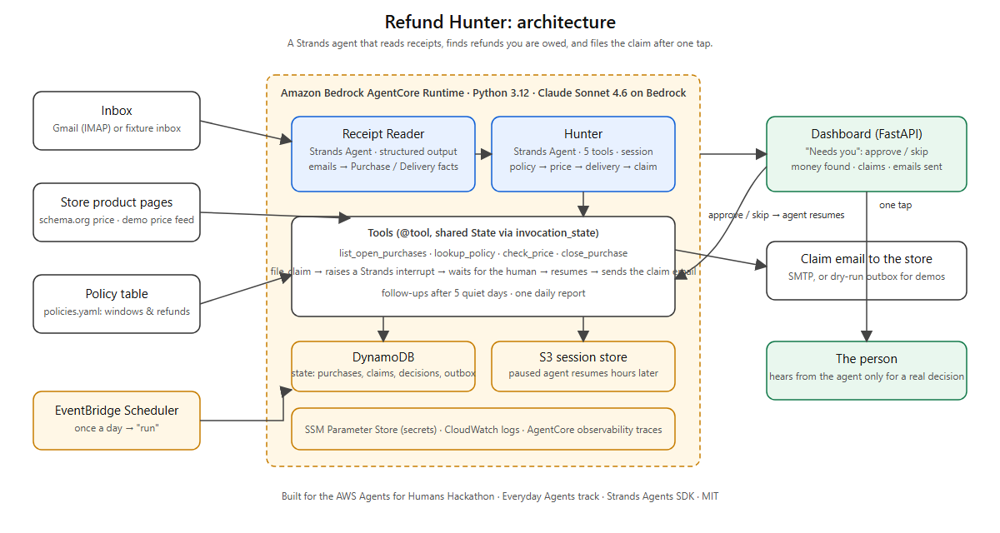

# Refund Hunter

**An agent that reads your receipts, finds the refunds you are owed, and files the claim once you say yes.**

Stores owe people money all the time and almost nobody collects it. Target and Costco refund the
difference when their own price drops within days of your order. Amazon refunds the shipping you paid
when it misses a guaranteed delivery date. Grocery delivery apps credit late orders. Every one of these
needs someone to notice, look up the rule, write the email, and chase the answer. Nobody does that for
a $22 air fryer. Refund Hunter does.

It runs in the background, once a day. It reads your order confirmations and delivery notices, keeps a
list of what you bought and when, checks each store's current price and your delivery dates against
that store's policy, and when it finds money it asks you one question: **"Target dropped your air fryer
by $22, 9 days into their 14-day window. File it?"** You tap yes. It sends the claim, logs it, and
follows up if the store goes quiet. If there is nothing to claim, you never hear from it.

> Built for the [AWS Agents for Humans Hackathon](https://agentsforhumans.devpost.com/), track
> **Everyday Agents**, with the [Strands Agents SDK](https://strandsagents.com/) on Amazon Bedrock
> AgentCore.

## What the agent does, end to end

```
inbox ──► Receipt Reader ──► purchases ──► Hunter ──► claim? ──► ⏸ ask you ──► file the claim ──► follow up
          (structured        (state)       policy · price · delivery    (Strands interrupt)   (email)         (5 quiet days)
           output)
```

1. **Reads mail.** Order confirmations, shipping notices, delivery notices. Newsletters and personal
   mail are ignored. Real Gmail over IMAP, or the built-in synthetic inbox for the demo.
2. **Knows the rules.** A small editable policy table (`policies.yaml`): price-adjustment windows,
   what a missed delivery date earns, where to send the claim.
3. **Checks every open purchase.** Current price from the product page (schema.org data) or the demo
   price feed. Delivery date versus promised date. Days since order versus the window.
4. **Asks only when there is money.** Filing a claim raises a **Strands interrupt**. The agent stops,
   the dashboard shows the question, and nothing is sent until you tap *Yes, file it* or *Skip*.
5. **Resumes exactly where it stopped.** Your answer resumes the same agent session (file or S3
   session manager). It writes the claim email with the order number, the dates, the rule it relies
   on, and the amount, sends it, and records it.
6. **Follows up.** Claims with no answer after five days get one polite nudge.
7. **Reports.** One short summary per run. Money found, money filed, decisions waiting.

## Strands Agents in this project

| Piece | Strands feature |
|---|---|
| Receipt Reader (`agents/reader.py`) | `Agent.structured_output_async` into a Pydantic `Extraction` (purchases + delivery updates) |
| Hunter (`agents/hunter.py`) | `Agent` with five `@tool` tools; parallel tool calls; per-run shared `State` via `invocation_state` |
| Human decision | `tool_context.interrupt(...)` inside `file_claim`; `AgentResult.stop_reason == "interrupt"`; resume with `interruptResponse` |
| Multi-day pause | `FileSessionManager` locally, `S3SessionManager` on AgentCore, so a "yes" hours later resumes the same agent |
| Several claims at once | unanswered interrupts are answered `pending` and re-raised, so each claim waits for its own answer |
| Model | Claude Sonnet 4.6 on Amazon Bedrock (`BedrockModel`); `AnthropicModel` as a dev fallback |

## Architecture



| Piece | AWS |
|---|---|
| Agents | **Amazon Bedrock AgentCore Runtime** (`RefundHunter_Hunter`, CodeZip, Python 3.12), entrypoint `backend/agentcore_main.py`, actions `run` / `decide` / `state` |
| Model | Amazon Bedrock, Claude Sonnet 4.6 |
| State | **DynamoDB** table `refundhunter` (one document per user: purchases, claims, decisions, outbox, runs) |
| Paused agents | **S3** session store, so a decision made hours later resumes the same Hunter |
| Schedule | **EventBridge Scheduler** `refundhunter-daily`, once a day, universal target `bedrockagentcore:invokeAgentRuntime` |
| Secrets | SSM Parameter Store `/refundhunter/env` |
| Observability | CloudWatch logs, AgentCore traces |
| Dashboard | FastAPI + one HTML page (`refundhunter serve`), local or pointing at the runtime |

## Quick start (five minutes, no accounts needed)

```bash
cd backend
uv venv .venv --python 3.12
uv pip install -e ".[dev]" "strands-agents[anthropic]"
cp .env.example .env                 # defaults: Bedrock via your AWS credentials, fixture inbox, dry-run outbox
.venv/Scripts/refundhunter run       # read the demo inbox, hunt, pause on the first claims
.venv/Scripts/refundhunter decisions # see what it wants to ask you
.venv/Scripts/refundhunter decide <interrupt id> approve
.venv/Scripts/refundhunter serve     # dashboard at http://127.0.0.1:8000
```

No AWS credentials? Set `RH_MODEL_PROVIDER=anthropic` and `ANTHROPIC_API_KEY`.

**Real inbox.** Create a Gmail App Password and set `RH_MAIL_SOURCE=imap`, `RH_IMAP_USER`,
`RH_IMAP_PASSWORD`. To let it send real claim emails set `RH_SMTP_USER` / `RH_SMTP_PASSWORD`; set
`RH_CLAIMS_TO_OVERRIDE=you@example.com` while testing so every claim lands in your own inbox
instead of a store's.

## Demo data

The fixture inbox (`backend/fixtures/inbox.json`) is fully synthetic: a made-up person, made-up
order numbers, `.example` sender domains. Dates are relative to the day you run it, so the demo
always lands inside the stores' windows. It contains:

| Email | What the agent should do |
|---|---|
| Target air fryer, $129.99, 9 days ago; now $107.99 | price drop inside 14-day window → propose **$22.00** |
| Costco vacuum, $499.99, 12 days ago; now $449.99 | price drop inside 30-day window → propose **$50.00** |
| Amazon LEGO set, $12.99 one-day shipping, delivered 2 days after the guaranteed date | late delivery → propose **$12.99** shipping refund |
| Best Buy headphones, 20 days ago | outside the 15-day window → close, no claim |
| Walmart pressure cooker, delivered on time | no price-adjustment policy, on time → close |
| Home Depot drill, price unchanged | keep watching |
| A newsletter and a note from a friend | ignore |

`refundhunter reset` (or the dashboard's *Reset demo*) wipes the state for a fresh run.

## Deploy

```bash
# once: state table + session bucket
backend/.venv/Scripts/refundhunter create-table
aws s3 mb s3://refundhunter-sessions-<account>

# the runtime (agentcore/agentcore.json + backend/agentcore-policy.json)
agentcore deploy --yes

# the daily schedule
python infra/schedule.py --runtime-arn <runtime arn>

# the dashboard against the runtime
RH_STORE=dynamodb RH_AGENT_RUNTIME_ARN=<runtime arn> refundhunter serve
```

Cost guard: the agent only runs when the schedule fires (once a day) or someone presses *Run*.
There are no pollers. One run is a handful of model calls.

## Layout

```
backend/
  refundhunter/
    agents/reader.py    Receipt Reader (structured output)
    agents/hunter.py    Hunter agent, tools, the interrupt, claim emails
    run.py              one daily run; answering a decision; follow-ups
    api.py + dashboard.html   the one-page dashboard
    mail/               fixture inbox, IMAP reader, SMTP / dry-run sender
    pricing.py          current price: schema.org on the product page, else the demo feed
    policies.yaml       store rules (edit me)
    store.py            state: local JSON or DynamoDB
  agentcore_main.py     AgentCore entrypoint
  fixtures/             synthetic inbox + price feed
  tests/
agentcore/agentcore.json   runtime config
infra/schedule.py          EventBridge daily schedule
docs/                      architecture diagram, video script
```

## Honest notes

- The policy values shipped are illustrative. Check a store's current policy page before relying on
  a number; the table is meant to be edited.
- Price reading works on pages that publish schema.org `Product` data. Stores that block bots fall
  back to the price feed or to "unknown", and the agent then claims nothing.
- Claim emails go to the address in the policy table. For a real store you would put its real
  support address there, or use the store's chat and paste the text the agent wrote.
- Everything in the demo is synthetic. No real orders, people, or addresses.

## License

MIT. See [LICENSE](LICENSE).
